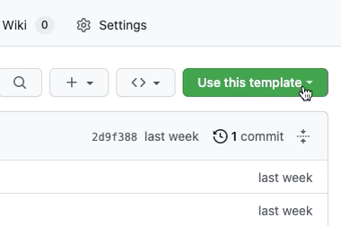
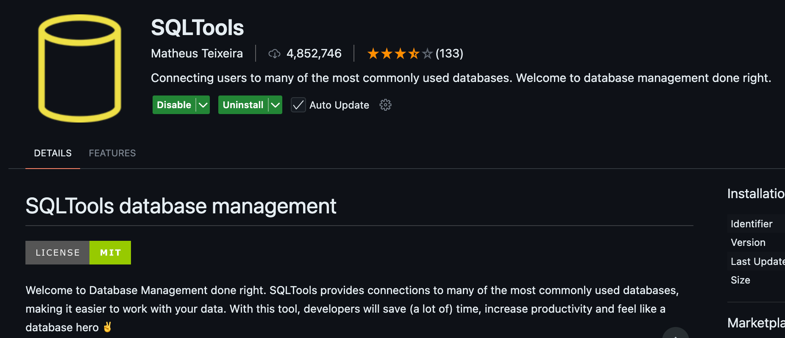

# 🚀 DBT Sandbox Environment in GitHub Codespaces Template

<br/><br/>

Welcome to the **DBT Sandbox Environment**! This GitHub Codespace template lets you (and anyone else) spin up a fully-functional **dbt development environment** with just a few clicks. 

✨ Once set up, you'll have:
- A complete dbt environment ready to go.
- A connection to a DuckDB database.
- One year of data from the fictional **Jaffle Shop café** to work with.

---


## 🛠 How to Use this template

<br/><br/>

### Step 1: **Create Your Repository**

<br/><br/>

Click the big green **'Use this template'** button, then select **'Create a new repository'**.



⚠️ **Note**: Make sure to create the repository in your personal GitHub space and **not** under `moj-analytical-services` or any other organization.

---

### Step 2: **Launch Your Codespace**

<br/><br/>

Navigate to **'Code'**, select **'Codespaces'**, and click **'Create codespace on main'**.


This will set up a sandboxed development container with everything pre-configured for your dbt project.

<br/><br/>

---

### Step 3: **Patience Is Key**

<br/><br/>

Setting up the codespace takes about **4 minutes**. 🕒 
Perfect time to brew yourself a nice cup of tea ☕️.

<br/><br/>

---

### Step 4: **Run Your First dbt Command**

<br/><br/>

Once the setup is complete, navigate to the terminal in your Codespace environment and run:

```bash
dbt build
```

<br/><br/>


### Step 5: **Install a DuckDB connector extension **


To view and query your dbt transformation results directly in your Codespace, you'll need to install a DuckDB-compatible extension. 

We recommend installing the **SQLTools** extension in VS Code for this purpose. 



---

💡 **Tip**: Once installed, configure SQLTools to connect to your DuckDB database, 
which exists in `/reports/jaffle_shop.duckdb`and you'll be able to explore your transformed data with ease!


## 🛠 What to after installing the codespace in your repo and setting everything up:


